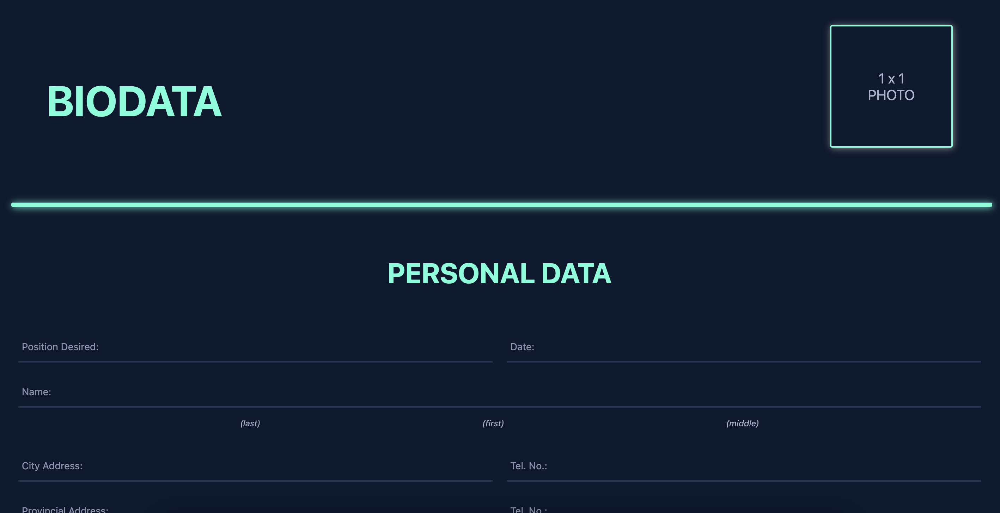

# Biodata Form



## Overview
This project is a fully responsive **Biodata Form** created with HTML and CSS, designed to collect detailed personal, educational, employment, and reference information. The form includes sections for uploading photos and digital signatures, making it suitable for official applications or records.

---

## Features
1. **Personal Data Section**
   - Fields for basic details:
     - Position Desired
     - Name (Last, First, Middle)
     - Address (City and Provincial)
     - Contact Information (Tel. No., Email)
     - Date and Place of Birth
     - Physical Details (Height, Weight)
     - Civil Status, Citizenship, and Sex
   - Spouse, Parents, and their occupations.

2. **Education Attainment Section**
   - Input fields for:
     - Name of School and Address
     - Degree Received
     - Year Attended
     - Special Skills or Others

3. **Employment Record Section**
   - Input fields for:
     - Company Name
     - Address
     - Position
     - Employment Period (From-To)

4. **Character References**
   - Fields for:
     - Name
     - Address
     - Position
     - Contact Number

5. **Additional Certifications**
   - Fields for:
     - Res. Cert. No. A
     - Issued At, Issued On
     - SSS No., TIN, NBI Clearance No., Passport No.
     - Place of Issue, Date

6. **Photo and Digital Signature Upload**
   - Upload fields for:
     - 1x1 Photo
     - Digital Signature

7. **Submission**
   - Includes a submit button to process the form.

---

## Technologies Used
- **HTML5**: For structuring the form elements.
- **CSS3**: For styling and layout.
- **JavaScript (optional)**: Add validations or dynamic interactions (if needed).

---

## File Structure

biodata-form/
├── src/
│   ├── styles.css         # CSS for styling the form
├── index.html             # Main HTML file
├── welldone.html          # Submission confirmation page

---

## Installation
1. **Clone the repository**:
   ```bash
   git clone https://github.com/angelomahusay/biodata-form.git
   cd biodata-form